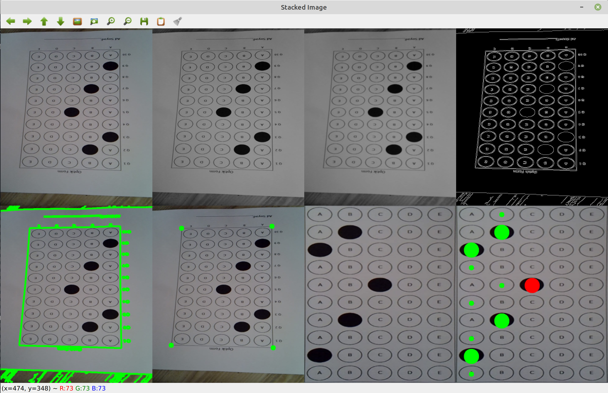
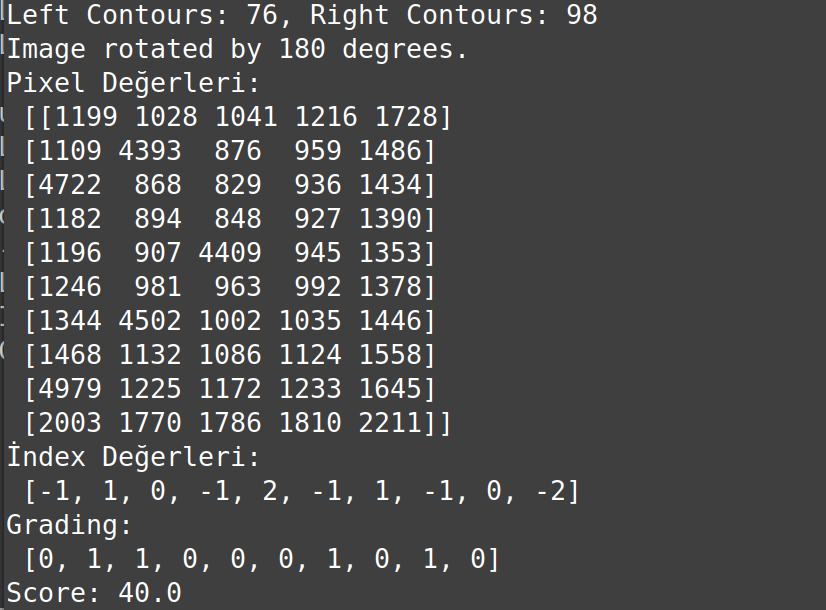

# OPTICAL-MARK-RECOGNITION

#The output of the project

# Automatic Exam Question Solver

This project is used to detect correct answers from an exam paper image and calculate the exam grade. The project is developed in OpenCV and Python.

## Requirements

- Python 3.x
- OpenCV
- NumPy

## Installation

1. Clone the project to your computer or download it as a ZIP.
2. Run the following command in terminal or command prompt to install the required Python libraries:
3. pip install opencv-python numpy
4. Copy your project files and sample exam image to the location you specified.
   

## Usage

1. Run the `OMR-MAIN.py` file.
2. The program will process the specified exam image and display the results on the screen.
3. A window will open on the screen showing the processed steps and results of the exam image.

## Additional Information

- The `utlis.py` file contains helper functions that perform the operations.
- The project is designed for a specific exam format only and cannot be used as a general purpose exam paper solver.

   

 
